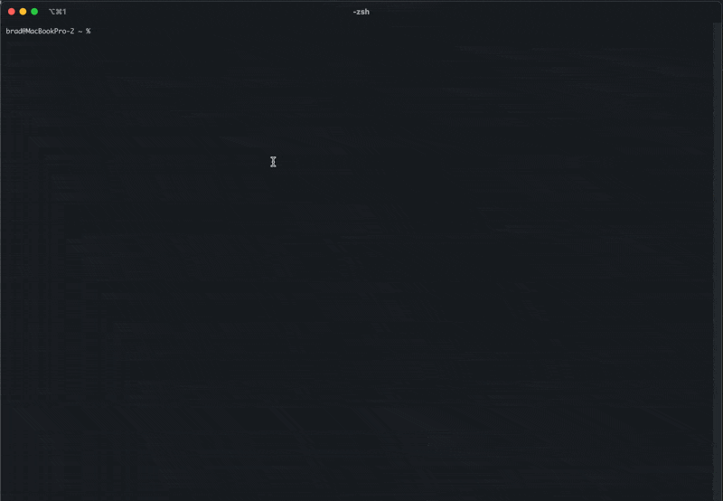
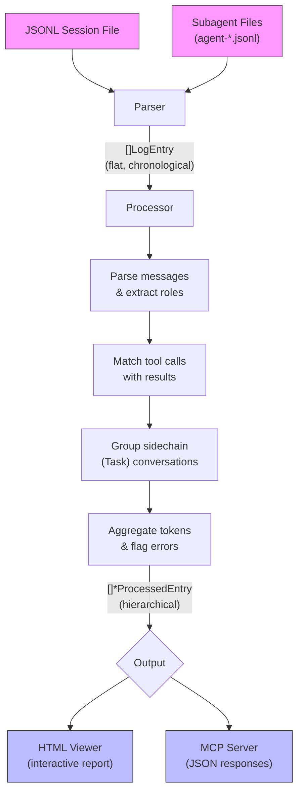

# Claude Code Log Viewer

A toolkit for working with Claude Code session logs:
- **CLI Viewer**: Converts JSONL log files into interactive HTML
- **MCP Server**: Exposes session logs via Model Context Protocol for AI-powered analysis



## Installation

Requires Go 1.21 or later. Install Go from https://go.dev/

### From Source

```bash
git clone https://github.com/vprkhdk/cclogviewer
cd cclogviewer
make build              # Build HTML viewer
make build-mcp          # Build MCP server
make build-all-binaries # Build both
```

### Direct Install

```bash
# HTML viewer
go install github.com/vprkhdk/cclogviewer/cmd/cclogviewer@latest

# MCP server
go install github.com/vprkhdk/cclogviewer/cmd/cclogviewer-mcp@latest
```

### Using Make

```bash
make install        # Install HTML viewer
make install-mcp    # Install MCP server
make install-all    # Install both
```

---

## HTML Viewer

Converts Claude Code JSONL log files into interactive HTML for easy reading.

### Usage

```bash
# Quick view (auto-opens in browser)
cclogviewer -input session.jsonl

# Save to file
cclogviewer -input session.jsonl -output conversation.html

# Save and open
cclogviewer -input session.jsonl -output conversation.html -open
```

### Arguments

| Flag | Description |
|------|-------------|
| `-input` | JSONL log file path (required) |
| `-output` | HTML output path (optional, auto-generates temp file if omitted) |
| `-open` | Open in browser (automatic without -output) |
| `-debug` | Enable debug logging |

### Features

- Hierarchical conversation display
- Expandable tool calls and results
- Nested Task tool conversations (sidechains)
- Token usage tracking
- Syntax-highlighted code blocks
- ANSI color support in terminal output
- Timestamps and role indicators

---

## MCP Server

The MCP server exposes Claude Code session logs via the [Model Context Protocol](https://modelcontextprotocol.io/), allowing AI assistants to query and analyze your coding sessions.

### Configuration

#### Using Claude CLI (Recommended)

Add the MCP server globally (available in all projects):

```bash
claude mcp add cclogviewer cclogviewer-mcp
```

Or add it to a specific project only:

```bash
claude mcp add -s project cclogviewer cclogviewer-mcp
```

To verify the server was added:

```bash
claude mcp list
```

To remove the server:

```bash
claude mcp remove cclogviewer
```

#### Manual Configuration

Alternatively, add to your Claude Code settings manually.

**Global** (`~/.claude/settings.json`):

```json
{
  "mcpServers": {
    "cclogviewer": {
      "command": "cclogviewer-mcp"
    }
  }
}
```

**Project-local** (`.claude/settings.local.json` or `.mcp.json` in project root):

```json
{
  "mcpServers": {
    "cclogviewer": {
      "command": "cclogviewer-mcp"
    }
  }
}
```

Or with full path if the command isn't in your PATH:

```json
{
  "mcpServers": {
    "cclogviewer": {
      "command": "/path/to/cclogviewer-mcp"
    }
  }
}
```

> **Note:** Restart Claude Code after adding the MCP server for changes to take effect.

### Available Tools

#### Discovery & Navigation
| Tool | Description |
|------|-------------|
| `list_projects` | List all Claude Code projects with session counts |
| `list_sessions` | List sessions for a project with time filtering |
| `list_agents` | List available agent definitions (global + project) |
| `get_agent_sessions` | Find sessions where a specific agent type was used |
| `search_logs` | Search across sessions by content, tool, or role |

#### Session Analysis
| Tool | Description |
|------|-------------|
| `get_session_logs` | Get full processed logs for a specific session |
| `get_session_summary` | Lightweight overview: message counts, tokens, tool stats |
| `get_tool_usage_stats` | Detailed tool usage patterns and sequences |
| `get_session_errors` | Extract errors and blockers for debugging |
| `get_session_timeline` | Condensed step-by-step progression |
| `get_session_stats` | Combined stats (summary + tools + errors) |

#### Debugging
| Tool | Description |
|------|-------------|
| `get_logs_around_entry` | Get context around a specific entry by UUID |
| `generate_html` | Generate interactive HTML from session logs |

### Tool Details

#### list_projects

List all Claude Code projects with metadata.

```json
{
  "sort_by": "last_modified"  // Options: "last_modified", "name", "session_count"
}
```

#### list_sessions

List sessions for a project with optional filtering.

```json
{
  "project": "myproject",        // Required: project name or path
  "days": 7,                     // Optional: only last N days
  "include_agent_types": true,   // Optional: extract subagent types used
  "limit": 50                    // Optional: max sessions to return
}
```

#### get_session_logs

Get full conversation logs for a session.

```json
{
  "session_id": "uuid-here",     // Required: session UUID
  "project": "myproject",        // Optional: helps locate session faster
  "include_sidechains": true     // Optional: include agent conversations
}
```

#### generate_html

Generate an interactive HTML file from session logs. Accepts either a `session_id` or a direct `file_path` to a JSONL file. If no output path is specified, creates a temporary file. By default, auto-opens in browser when no output path is given.

```json
{
  "session_id": "uuid-here",       // Session UUID (use this OR file_path)
  "file_path": "/path/to/log.jsonl", // Direct JSONL file path (use this OR session_id)
  "project": "myproject",          // Optional: helps locate session faster (only with session_id)
  "output_path": "/path/to.html",  // Optional: save to specific path (temp file if omitted)
  "open_browser": true             // Optional: open in browser (auto-opens if no output_path)
}
```

Examples:
```json
// Using session_id
{ "session_id": "abc123-def456", "open_browser": true }

// Using direct file path
{ "file_path": "/path/to/session.jsonl", "open_browser": true }
```

Returns:
```json
{
  "output_path": "/path/to/generated.html",
  "session_id": "uuid-here",
  "project": "myproject",
  "opened_browser": true
}
```

#### list_agents

List available agent definitions.

```json
{
  "project": "/path/to/project", // Optional: include project-specific agents
  "include_global": true         // Optional: include ~/.claude/agents/
}
```

#### get_agent_sessions

Find sessions that used a specific agent type.

```json
{
  "agent_type": "Explore",       // Required: agent/subagent type name
  "project": "myproject",        // Optional: limit to specific project
  "days": 30,                    // Optional: only last N days
  "limit": 20                    // Optional: max sessions to return
}
```

#### search_logs

Search across sessions by various criteria.

```json
{
  "query": "authentication",     // Optional: text to search for
  "tool_name": "Bash",           // Optional: filter by tool name
  "role": "assistant",           // Optional: "user" or "assistant"
  "project": "myproject",        // Optional: limit to project
  "days": 7,                     // Optional: only last N days
  "include_sidechains": true,    // Optional: search agent conversations
  "limit": 50                    // Optional: max results
}
```

---

### Session Analysis Tools

#### get_session_summary

Get a lightweight overview of a session without full logs.

```json
{
  "session_id": "uuid-here",     // Required: session UUID
  "project": "myproject",        // Optional: helps locate session faster
  "agent_id": "a909e0c",         // Optional: analyze specific subagent
  "include_sidechains": true     // Optional: include agent conversations
}
```

Returns message counts, token usage, tool statistics, and error counts.

#### get_tool_usage_stats

Get detailed tool usage patterns for a session.

```json
{
  "session_id": "uuid-here",     // Required: session UUID
  "project": "myproject",        // Optional
  "agent_id": "a909e0c",         // Optional: specific subagent
  "include_sidechains": true     // Optional
}
```

Returns per-tool counts, success/failure rates, tool sequence, and patterns (most used, most failed, first/last tool).

#### get_session_errors

Extract errors and blockers from a session for debugging.

```json
{
  "session_id": "uuid-here",     // Required: session UUID
  "project": "myproject",        // Optional
  "limit": 20,                   // Optional: max errors to return
  "include_sidechains": true     // Optional
}
```

Returns:
```json
{
  "session_id": "uuid-here",
  "total_errors": 15,
  "errors": [
    {
      "uuid": "error-uuid",      // Use with get_logs_around_entry
      "timestamp": "12:38:40",
      "type": "tool_error",
      "tool_name": "Bash",
      "message": "Exit code 1\ncommand not found",
      "entry_index": 24
    }
  ],
  "categories": {
    "tool_error": 10,
    "console_error": 5,
    "validation_error": 0
  }
}
```

#### get_session_timeline

Get a condensed timeline showing step-by-step progression.

```json
{
  "session_id": "uuid-here",     // Required: session UUID
  "project": "myproject",        // Optional
  "limit": 100,                  // Optional: max entries
  "include_sidechains": true     // Optional
}
```

Returns a simplified view of each step with timestamps, roles, tools used, and status indicators.

#### get_session_stats

Get comprehensive statistics combining summary, tool usage, and errors.

```json
{
  "session_id": "uuid-here",     // Required: session UUID
  "project": "myproject",        // Optional
  "generate_html": true,         // Optional: also generate HTML visualization
  "open_browser": true,          // Optional: open HTML in browser
  "errors_limit": 10,            // Optional: max errors to include
  "include_sidechains": true     // Optional
}
```

---

### Debugging Tools

#### get_logs_around_entry

Get context around a specific log entry identified by UUID. Use this after `get_session_errors` to investigate what led to an error or what happened after.

```json
{
  "session_id": "uuid-here",     // Required: session UUID
  "uuid": "entry-uuid",          // Required: target entry UUID (from get_session_errors)
  "project": "myproject",        // Optional
  "offset": -3,                  // Direction: negative=BEFORE, positive=AFTER
  "include_sidechains": true     // Optional
}
```

**Offset parameter:**
- `offset: -3` → Get 3 entries BEFORE the target + target itself
- `offset: 3` → Get target + 3 entries AFTER

**Example workflow:**
```
1. get_session_errors → find error with uuid "abc123"
2. get_logs_around_entry(uuid: "abc123", offset: -3) → see what caused the error
3. get_logs_around_entry(uuid: "abc123", offset: 3) → see the fix attempt
```

Returns full context including tool inputs/outputs:
```json
{
  "entries": [
    {
      "offset": -1,
      "timestamp": "13:06:07",
      "role": "assistant",
      "tool_name": "Bash",
      "tool_input": {"command": "make install"},
      "tool_output": "Exit code 1\ncommand not found"
    },
    {
      "offset": 0,
      "timestamp": "13:06:15",
      "content": "Error: make not found",
      "is_error": true
    }
  ]
}
```

### Testing the MCP Server

```bash
# List available tools
echo '{"jsonrpc":"2.0","id":1,"method":"tools/list"}' | cclogviewer-mcp

# List projects
echo '{"jsonrpc":"2.0","id":2,"method":"tools/call","params":{"name":"list_projects","arguments":{}}}' | cclogviewer-mcp

# List sessions for a project
echo '{"jsonrpc":"2.0","id":3,"method":"tools/call","params":{"name":"list_sessions","arguments":{"project":"myproject","days":7}}}' | cclogviewer-mcp
```

---

## Architecture

```
cclogviewer/
├── cmd/
│   ├── cclogviewer/          # HTML viewer CLI
│   └── cclogviewer-mcp/      # MCP server CLI
├── internal/
│   ├── mcp/                  # MCP protocol & tools
│   │   ├── server.go         # JSON-RPC 2.0 handler
│   │   └── tools.go          # Tool implementations
│   ├── service/              # Business logic
│   │   ├── project.go        # Project discovery
│   │   ├── session.go        # Session management
│   │   ├── agent.go          # Agent definitions
│   │   └── search.go         # Log search
│   ├── models/               # Data structures
│   ├── parser/               # JSONL parsing
│   ├── processor/            # Log processing & hierarchy
│   └── renderer/             # HTML generation
```

### Processing Pipeline

Both the CLI viewer and MCP server share the same processing pipeline. Raw JSONL lines are parsed into log entries, then transformed into a hierarchical structure with matched tool calls, grouped subagent conversations, and aggregated token metrics.



### Log Storage

Claude Code stores session logs in `~/.claude/projects/`:

```
~/.claude/projects/
├── -Users-name-Projects-myapp/     # Encoded project path
│   ├── <session-uuid>.jsonl        # Main session log
│   └── <session-uuid>/
│       └── subagents/
│           └── agent-<id>.jsonl    # Subagent logs
```

### Agent Definitions

Custom agents are defined in `.md` files with YAML frontmatter:

- Global: `~/.claude/agents/*.md`
- Project: `<project>/.claude/agents/*.md`

---

## Development

```bash
make build              # Build HTML viewer
make build-mcp          # Build MCP server
make test               # Run tests
make test-coverage      # Run tests with coverage
make lint               # Run linter
make fmt                # Format code
```

See `make help` for all available commands.

## License

MIT
